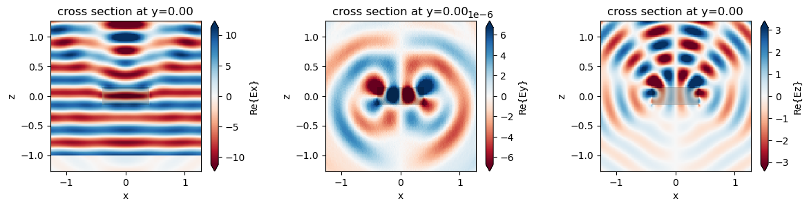
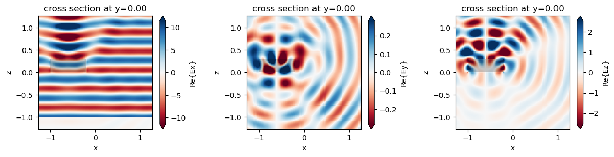

# Experimentation Notes 

Old Links
[fdtd](https://github.com/flaport/fdtd)
[textbook](https://github.com/natsunoyuki/blog_posts/blob/main/physics/1D%20Electromagnetic%20FDTD%20in%20Python.ipynb)

Mar 7 
- Tried Tidy3d after fdtd, meep, and plain matplotlib

https://www.flexcompute.com/tidy3d/examples/notebooks/STLImport/

you can load stl files, but it seems like cylindrical objects don't work with a plane wave (smth about multiple plans and that they must be homogenous). I might be misunderstanding exactly what's going on behind `PlaneWave`. 

- Worked on Ring Resnoator, with two oppsitely directed cables and a coil in middle -- what is flux doing there? How do you calculate time series simulations? 

